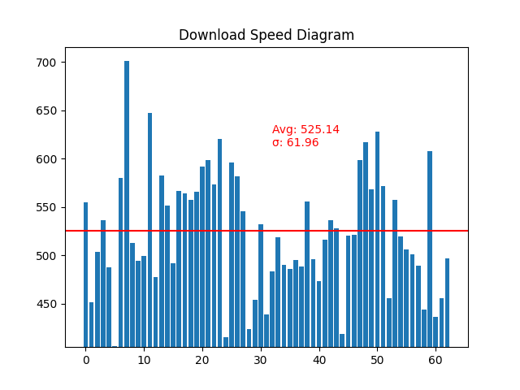
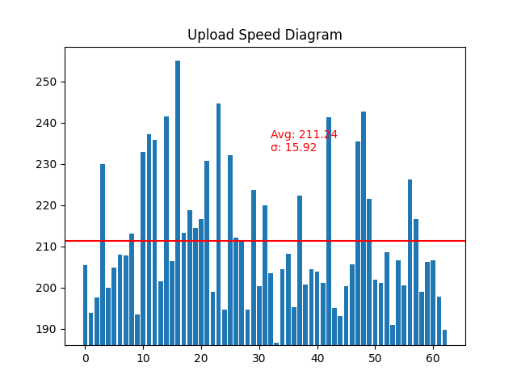

# Why?

Yesterday was my first day as a lucky Fibered Internet user, so the bragging question is: What is my Download Speed? What is my Upload?

You have plenty of website to calculate your speed but I have found them not so reliable and maybe sometimes overoptimistic.
So even if it is nice to be able to brag about a 969 Mbit download speed, the interesting point is to have your real speed over the day.

Using only Linux machines at home, I am able to use a crontab.
Being a Python teacher, I am indeed a pythonista at heart so the answer was easy: Let's build a small project to calculate this fiber speed and show it visually!

The other ideas I was willing to tackle was:
* Showcase of dealing with files in order to replace common bash shell usage
* Showcase Visualisation rendering directly in Python rather than create an ODS/XLS file and create a graph with LibreOffice/Excel ;-)


# How?

First thing was finding a reliable Internet speed tool. Quick internet research showed up with speedtest-cli to be pip-installed, however it comes as a package in Ubuntu so 
```sudo apt install speedtest-cli```

The tool works like this:
```shell script
speedtest-cli

Retrieving speedtest.net configuration...
Testing from Free SAS (91.170.84.1)...
Retrieving speedtest.net server list...
Selecting best server based on ping...
Hosted by ORANGE FRANCE (Lyon) [57.73 km]: 23.043 ms
Testing download speed................................................................................
Download: 557.63 Mbit/s
Testing upload speed......................................................................................................
Upload: 190.94 Mbit/s
```

so we will make a small shell script
```shell script
vi ~\speedtest.sh
```
with the following code
```shell script
#!/usr/bin/bash
speedtest-cli > "/your/path/to/file/speedtest_`date +'%m-%d-%y %T'`.txt"

```

After that we will make a new crontab for it
```shell script
crontab -e
```
with the following line to get a new mesure every 30 min
```shell script
0,30 * * * * /home/{YOUR_NAME_GOES_HERE}/speedtest.sh
```

#What?

Generally I will get the results of my files with a nice one-liner like this
```shell script
ls | xargs -I {} cat "{}" | egrep -i "^download|^upload"
```
But the idea now will be to use this exercise as a template to rather python than shell my needs ;-)

So now we will create the python script and see how to print a nice graph of it.

As we will also try to prevent the need of an Excel like tool, we will need to have some modules installed
```shell script
sudo apt install python3-tk
pip3 install matplotlib
```

# With?

You should get something like that:




#Yes but Why?
I agree it is not so very useful except to brag a little and be happy of having Fiber internet at last.  
In any case, we all agree that the ultimate download test is: What is this 8Gb game sitting in my Steam library that I have never tested? And 5 min later you discover a real fun new game: [Brutal Legend](https://store.steampowered.com/app/225260/Brutal_Legend/)!

Enjoy :-)